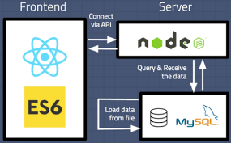

# react-express-lerna
monorepo project React App / Express

#create new project
- yarn create vite
- cd name_project 
- yarn
- yarn create @eslint/config
- yarn add -D eslint-config-prettier prettier
- add workspace plugins Eslint and Prettier - Code formatter
- add settings.json in .vscode
```json 
{
    "editor.formatOnSave": true,
    "[typescript]": {
        "editor.defaultFormatter": "esbenp.prettier-vscode"
    },
    "[typescriptreact]": {
        "editor.defaultFormatter": "esbenp.prettier-vscode"
    },
    "[javascript]": {
        "editor.defaultFormatter": "esbenp.prettier-vscode"
    },
    "[javascriptreact]": {
        "editor.defaultFormatter": "esbenp.prettier-vscode"
    }
}
```

# Database
>install mysql, create dbname and change name in packages/server/.env
- run command sequelize `npx sequelize-cli db:migrate`

[](https://sequelize.org/docs/v6/getting-started/)

#Amazon 

 - criar um bucket [AWS BUCKET](https://s3.console.aws.amazon.com/s3/buckets?region=us-east-1&region=us-east-1) 
 - criar um usuário [AWS USER](https://us-east-1.console.aws.amazon.com/iamv2/home?region=us-east-1#/users)
- Política de Permissão > `AmazonS3FullAccess`
- Credenciais de Segurança > Chaves de Acesso > Criar chave de acesso > `Aplicação executada fora da AWS` 
- .env 
  ```json 
    AWS_ACCESS_KEY_ID=
    AWS_SECRET_ACCESS=
    AWS_DEFAULT_REGION=us-east-1
  ```